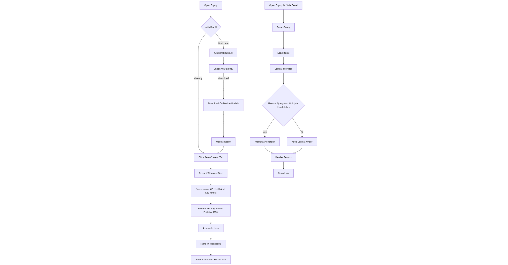
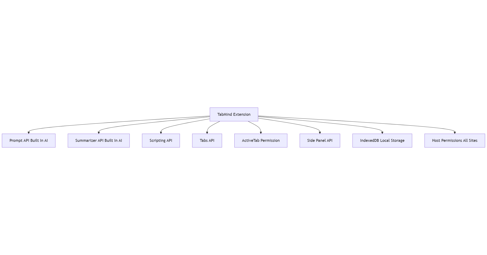
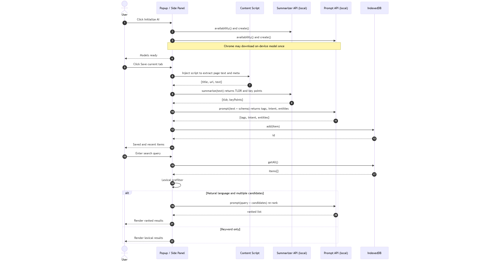

# TabMind - Local Tab Saver (Built-in AI)

TabMind is a Chrome extension that turns the pages you are reading into rich, searchable notes. It runs fully on-device using Chrome's built-in AI capabilities to produce TL;DR summaries, key points, and smart tags that stay in your local IndexedDB.

**Privacy:** 100% local. No servers, API keys, or third-party calls. After Chrome downloads the Gemini Nano models one time, everything works offline.

## Features
- One-click **Save current tab** from the popup or the side panel. Captures page text, current selection, and metadata before handing everything to the on-device models.
- **Instant library access** in the side panel with editable cards, ratings, tag management, and inline search filters.
- **Natural language recall** powered by local re-ranking, letting you type prompts like "show me the CSS grid article" and have the best matches rise to the top.
- **Markdown export** of the current result set from the side panel so you can keep a snapshot of links, ratings, tags, and summaries.
- Clean local storage via IndexedDB; data never leaves the browser.

## Install (Unpacked)
1. Open `chrome://extensions` and enable **Developer mode**.
2. Click **Load unpacked** and select the folder `TabMind_Local_Tab_Saver`.
3. Pin **TabMind** from the toolbar and click it to open the popup.
4. Use **Initialize AI** once so Chrome can download the on-device models (requires a user gesture).
   - Track progress in the UI or at `chrome://on-device-internals`.

## Using the extension
- **Save as you browse:** press **Save current tab** in the popup or in the side panel to capture the tab immediately. The extension enriches the note in the background with summaries, tags, and entities.
- **Search and filter:** the side panel supports field filters (title, tags, description) and ordering (date or rating). Natural language queries automatically trigger re-ranking when multiple matches exist.
- **Edit and rate:** click the pencil icon on any saved card to adjust tags, TL;DR, or key points. Star ratings help surface your best references.
- **Export results:** click the export icon next to the side panel title to download the current search results as a Markdown file. The export includes the title, rating, tags, summary, and key points for each entry.

## How it stays local
- Uses **Summarizer API** (`Summarizer.create()` / `Summarizer.summarize`) for TL;DR and key points.
- Uses **Prompt API** (`LanguageModel.create()` / `session.prompt`) with a JSON Schema constraint to extract tags, intent, and entities, and to power semantic re-ranking.
- Both APIs are built into Chrome and execute Gemini Nano locally once the models are downloaded.

## Known limitations (future polish ideas)
- Built-in AI APIs are not yet available in service workers, so all AI calls happen in the popup or side panel contexts.
- Very large libraries may benefit from adding an OPFS/IndexedDB full-text index and chunked re-ranking.
- The initial model download needs a user gesture and enough disk space; if the download fails Chrome will report it in `chrome://on-device-internals`.

## Visual guides

## Docs
- Prompt API (Gemini Nano in-browser): https://developer.chrome.com/docs/ai/prompt-api
- Summarizer API (Chrome 138+): https://developer.chrome.com/docs/ai/summarizer-api
- Extensions + AI overview: https://developer.chrome.com/docs/extensions/ai
